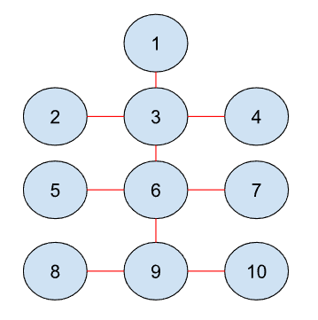

---

**Intro**:

Introduces a new script terminal that runs user defined code. Fully open environment and no sandboxing at all (same access level as Factorio's mod API).

Of course it's not just a script terminal though. It also comes with my API, which makes scripting and prototyping certain things much faster, and easier. 

There's also a virtual file system tool, but likely not needed unless youre making a massive script, or just like having clean modular code.

---

**Up next**:

Up next, I'm going to show some examples on how to use my API, and what it can do, and how it builds up to actual in game use.

---

**Usage of the wire system**:



Let's say we had this wire network. By itself, it doesn't do much. It only defines the topology, but no logic. That's where the scripting part comes in.

``` lua
Markers.set_marker_name(1, "circles") -- the marker name is set ingame via a gui, but we do this for now since it's an example.

local markers = Markers.get_markers("circles") -- multiple markers can have the same name, hence get_markers
local red_graph = Wires.get_graph("red")

local marker_id = markers[1] -- for this example, theres only 1 marker named "circles", hence index = 1

local network = red_graph:get_network(marker_id) -- gets the network. from the image, it will return [1, 10].

for i = 1, #network do
    local id = network[i]
    print(id)

    -- can do more fancy stuff...
end
```

outputs:
- 1, 2, 3, 4, 5, 6, 7, 8, 9, 10

This basically gives you an elegant way to seperate topology from logic. Just a very simple scenario.

---

**Usage of the scheduler and hooker**:

Let's say we wanted to simulate notifications. One guy notifies every second, and another guy receives it, but responds 2 seconds late everytime.

``` lua
-- 60 ticks in one second
local initial_delay = 1 -- 1 tick delay aka 1/60th of a second

Scheduler:schedule(initial_delay, function ()
    Hooker:trigger_hook("notify", "I notified you at tick " .. Scheduler.tick .. ", I'll notify you again in 1 second")
    return 60 -- 1 second delay
end)

Hooker:add_hook("notify", function(message)
    local response_delay = 120 -- 2 second delay
    Scheduler:schedule(response_delay, function ()
        print("I've received your message.")
        print("You said: " .. message)
        print("I responded 2 seconds late at tick " .. Scheduler.tick .. ", sorry for the delay!")
        return false -- return false to remove the callback
    end)
end)

```

outputs:
- I notified you at tick 1, I'll notify you again in 1 second
- I notified you at tick 61, I'll notify you again in 1 second

- **I've received your message.**
- **You said: I notified you at tick 1, I'll notify you again in 1 second**
- **I responded 2 seconds late at tick 121, sorry for the delay!**

- I notified you at tick 121, I'll notify you again in 1 second

- **I've received your message.**
- **You said: I notified you at tick 61, I'll notify you again in 1 second**
- **I responded 2 seconds late at tick 181, sorry for the delay!**

- I notified you at tick 181, I'll notify you again in 1 second

- cycle keeps going...

It's quite simple, but quite powerful.

---

**Usage of events**:

Hooking onto my events, or the game's events is pretty simple. Here's how it usually goes.

``` lua

---@param graph WireGraph
---@param id_a Id
---@param id_b Id
Hooker:add_hook(Events.on_wire_connect, function (graph, id_a, id_b)
    local entity_a = get_entity(id_a)
    local entity_b = get_entity(id_b)

    print("Events.on_wire_connect: ")
    print(serpent.block(entity_a))
    print(serpent.block(entity_b))
    print("wire_id: " .. graph.wire_id)
end)

---@param entity LuaEntity
---@param tags table<string, any>
Hooker:add_hook(Events.on_spawned, function (entity, tags)
    print("Events.on_spawned: ")
    print(serpent.block(entity))
    print(serpent.block(tags))
end)

---@param event EventData.on_entity_damaged
Hooker:add_hook(GameEvents.on_entity_damaged, function (event)
    print("GameEvents.on_entity_damaged: ")
    print(serpent.block(event))
end)

```

[get_entity](https://github.com/murk108/murk-core/blob/main/luaserver/globals.d.lua) just returns the LuaEntity from a entity's unit_number.

[Events](https://github.com/murk108/murk-core/blob/main/core/event_defines.lua) are custom events from my API. If you scroll down in [Murk Core headers](https://github.com/murk108/murk-core/blob/main/luaserver/headers.d.lua), you'll see the args for each event name.

[GameEvents](https://lua-api.factorio.com/latest/events.html) is just an alias for `defines.events`

[serpent](https://lua-api.factorio.com/latest/auxiliary/libraries.html) comes with Factorio's api, and it basically formats tables for you, to make prints more "pretty".

---

**In game usage**:


Let's say we wanted to add 1 iron plate every 10 seconds into all of these chests.

``` lua
local red_graph = Wires.get_graph("red")

Scheduler:schedule(1, function ()
    local markers = Markers.get_markers("entity_group") -- gets all markers named "entity_group"

    for i = 1, #markers do
        local marker_id = markers[i] -- in the picture, this is the chest marked "entity_group"
        local network = red_graph:get_network(marker_id)

        for j = 1, #network do -- loops over every chest in the picture
            local id = network[j] -- id of the chest
            local chest = get_entity(id)
            local inventory = chest.get_inventory(defines.inventory.chest)
            inventory.insert{name = "iron-plate", count = 1} -- adds 1 iron plate into the chest
        end
    end

    return 600 -- waits for 10 seconds before running again
end)
```

Very simple case here.

---

**In Game Controls**:

- **G** to open the **Script Terminal**, and the **Wire Selector**.
- **Click** on entities to open the marker renamer GUI.
- **Shift + Click** to connect entities with wire.
- **Shift + Right Click** to deselect the current entity.

---

**Dependencies**: 

- [Murk Core](https://github.com/murk108/murk-core)
- [Murk Wire System](https://github.com/murk108/murk-wire-system)

---

**Optional Virtual File System**:

Since the terminal only runs code, and Factorio doesn't allow file reading/writing, I made a tool to handle that issue. This tool basically allows you to write modular code, in different files, with `require` capabilitites, and still be able to run it all inside the terminal, in one paste. Just a quality of life thing. It's kind of like a mod loader, but done in-game at runtime.

[Lua Virtual Filesystem](https://github.com/murk108/lua-vfs)

---

**Documentation**:

This is the available documentation so far:
- [Murk Core Docs](https://github.com/murk108/murk-core/tree/main/luaserver)
- [Murk Wire System Docs](https://github.com/murk108/murk-wire-system/tree/main/luaserver)

This is also useful:
- [Factorio Lua API Docs](https://lua-api.factorio.com/)


If this is not enough, you can also dig through the source code. The script terminal has 0 sandboxing, so anything used in the source code is usable in the terminal (as long as it's in scope).

---

**VS Code Intellisense**:

To get intellisense working with my mods, you need the **Lua Language Server** plugin in VS Code. After, you need to add the `luaserver` folders into the **Lua.workspace.library** field inside `.vscode/settings.json`.

For example, like this:

``` json
"Lua.workspace.library": [
    "${env:APPDATA}\\Factorio\\mods\\murk-core_1.0.0\\luaserver",
    "${env:APPDATA}\\Factorio\\mods\\murk-wire-system_1.0.0\\luaserver"
]
```

It's also highly recommended to get [Factorio Modding Toolkit Plugin](https://marketplace.visualstudio.com/items?itemName=justarandomgeek.factoriomod-debug).

---

**Final Words**:

Using all these building blocks, you can theoretically automate your entire factory. Please don't cheat or troll ;). I mean... Nobody's stopping you from doing anything...